# BATCH-2021-June

Repositories &amp; exercises of batch 2021 july.

## PREFACE

This file and repository falls under the joint collaboration of students who participated in the Ibootcamp's very first session of lessons regarding git and github for absolute beginners. Batch-2021-june is the starting project that contains the depiction of the students' experiences while learning at this bootcamp with the hopes of creating a valuable asset for the future campers and beginners as well as to keep the track of our own development.

---

## Table of Contents

- [BATCH-2021-June](#batch-2021-june)
  - [PREFACE](#preface)
  - [Table of Contents](#table-of-contents)
  - [Setup and installation](#setup-and-installation)
  - [Markdown ✨](#markdown-)
    - [Introduction 📜](#introduction-)
    - [History 🕐](#history-)
    - [What is Markdown in simple language?? 🤔](#what-is-markdown-in-simple-language-)
    - [Markdown Cheat Sheets 📖](#markdown-cheat-sheets-)
  - [Git](#git)
  - [Guides](#guides)
  - [Why do we use git?](#why-do-we-use-git)
  - [Conclusion](#conclusion)
  - [Contributers](#contributers)


---

## Setup and installation

> First, you need to clone the repository inorder to access the content. <br/> `git clone https://github.com/iBootcamp/batch-2021-june.git`

---

## Markdown ✨

### Introduction 📜

Markdown is a lightweight markup language for creating formatted text using a plain-text editor. John Gruber and Aaron Swartz created Markdown in 2004 as a markup language that is appealing to human readers in its source code form.Markdown is widely used in blogging, instant messaging, online forums, collaborative software, documentation pages, and readme files.
<br>

### History 🕐

In 2002 Aaron Swartz created atx, "the true structured text format". Swartz and John Gruber then worked together to create the Markdown language in 2004, with the goal of enabling people "to write using an easy-to-read and easy-to-write plain text format, optionally convert it to structurally valid XHTML (or HTML)".<br>

Its key design goal is readability – that the language be readable as-is, without looking like it has been marked up with tags or formatting instructions, unlike text formatted with a markup language, such as Rich Text Format (RTF) or HTML, which have obvious tags and formatting instructions. To this end, its main inspiration is the existing conventions for marking up plain text in email, though it also draws from earlier markup languages, notably setext, Textile, and reStructuredText.<br>

Gruber wrote a Perl script, Markdown.pl, which converts marked-up text input to valid, well-formed XHTML or HTML and replaces angle brackets '<' '>' and ampersands '&' with their corresponding character entity references. It can take the role of a standalone script, a plugin for Blosxom or a Movable Type, or of a text filter for BBEdit.
<br>

### What is Markdown in simple language?? 🤔

It is a simple language just like markup language i.e (Html) but is more simpler than it or can also be said as lightweight markup language which is simply used for creating certain texts using a simple text editor. The read-me file that you are reading right now is also a markdown file. It's extension is `.md` which stands for markdown.
<br>

### Markdown Cheat Sheets 📖

In this section, you will find the easiest way to implement most of the Markdown syntax elements...

> Note:- Remember to save the file in `.md` extension to make it markdown.

There are two types of markdown syntax elements. Namely:-

1. Basic Syntax
2. Extended Syntax

**Basic Syntax:-** <br>
Generally, basic syntax are the very basic syntax of elements used in md (markdown files) which are supported by all markdown applications. Some basic syntaxes are given below: 👇
| Elements | Syntax |
| --------- | -------- |
| Heading | `# H1, ## H2, ### H3` |
| Bold text| `** I am bold **` |
| Italic text | `* I am italic *` |
| Blockquote | `> For writing blockquote` |
| Ordered List | `1. abc ` |
| ... |` 2. yoohoo` |
| ... |` 3. and so on` |
| Unordered List | `- abc ` |
| ... | `- yohoo `|
| ... | `- I m number 3 and so on` |
| Code | ` `` ` |
| Horizontal line / Margin | `---` |
| Link | `[title you want](url of it)` |
| Image | `` |
| Comment | `<!--- This is comment --->` |

> Note:-
>
> 1. In the elements section, "..." is used to determine the continuity of above elements.
> 2. The syntax used for code is ` `` ` called as tics. It's above the tab button in the keyboard.
>    <br>

**Extended Syntax:-**<br>
Basically, these syntax extends the properties or workings of the basic syntax by adding some additional features like creating the tables , fenced block notes and so on. Also, some syntaxes are given below: 👇
| Elements | Syntax |
| --------- | -------- |
| Footnote | `Here's a sentence with a footnote. [^1]` |
| .... | `[^1]: This is the footnote.` |
| Fenced Code Block | ` ``` ` |
| ... | `{` |
| ... | ` "firstName": "John", "lastName": "Smith", "age": 25` |
| ... | `}` |
| ... | ` ``` ` |
| Heading ID | `### My Great Heading {#custom-id} `|
| Definition List | `term` |
| ... | `: definition` |
| Strikethrough | `~~The world is flat.~~` |
| Task List | `- [x] Write the press release` |
| ... | `- [ ] Update the website` |
| ... | `- [ ] Contact the media` |
| Table | `| Anime | Cartoon |` |
| ... | `| ----- | ------- |` |
| ... | `| Hello | Bye-Bye |` |
| ... | `| Life | Happy | ` |

> Note:-
>
> 1. In the elements section, "..." is used to determine the continuity of above elements.
> 2. The `~` symbol is called as 'Tilde' and is present above tab button in the keyboard . Press " SHIFT + ` " to ge tilde ( ~ ) symbol.
>    <br>

_For further more information, you can click on link below to learn about the markdown cheat sheets. 👇_

_[Markdown Cheat Sheets](https://www.markdownguide.org/cheat-sheet/)_

_[Markdown Cheat Sheet Online](https://guides.github.com/pdfs/markdown-cheatsheet-online.pdf)_

---

## Git

- Introduction

  - Git

    > Git is a software which is used to in our local computer(PC or laptop) to track file or folders which contains data of users and saves the files or folders date for future use. Git is mordern way of saving, protecting and sharing our program files. Git is also known as version control software. Version control simply means the way of managing changes of the softwar code or application code with previous version and we can easily track previous data easily. Git can be used for personal use or office use(team use).We can use git with command line(Git bash) or with git GUI. There are other Git GUI interfaces which are easy to use example tortoise-git (https://tortoisegit.org/download/).

  - Github
    > Github is a online cloude aka online storage where we can keep our program file and documents mostly software data or codes over there. Github makes use of git hence we can view our commits and changes in github aslw well. We use git command to push local data(PC data) from our local repository(add link) to Github repository(Remote). In github we can get open source code and use it freely by cloning in our local computer. There are other similiar platform like gitlab bitbucket and many more.
  - Git vs Github

    | Git                                           | Github                                        |
    | --------------------------------------------- | --------------------------------------------- |
    | 1. Installe locally                           | 1. Hosted in the cloud                        |
    | 2. First released in 2005                     | 2. Company launched in 2008                   |
    | 3. Focused on version control and sharing     | 3. Focused on centralized source code hosting |
    | 4. Primarily a command line tool              | 4. Administered through the web               |
    | 5. Provides a desktop interface named Git Gui | 5. Desktop interface named Github Desktop     |
    | 6. No use management                          | 6. Built-in management                        |
    | 7. Minimal external tool                      | 7. Active marketplace for tool integration    |
    | 8. Open source licened                        | 8. Inludes a free tier and pay-for-use tiers  |

- Motivation
  <br>
  Being fascinated by computers and how it works since our childhood, we always wanted to dig deeper about learning more and more things about it. This Bootcamp can potentially be the spark which will ignite the curiousity inside us and make us aware and serious about the future that the IT profession holds for us. It can be a platform where we can sharpen our knowledge and experience about some of the important things we need to learn, being an IT student. Thats how, we began to start learning git and markdown.

- Guides
- Documentation

  - Initialize a repo
  - Remote<br>

    > Simply it's a path that helps to connect with repository.

  - Add Remote<br>

    > To add remote we have to give command at first.
    > The Command line is:<br> > `git remote add <name><(repository url)>`<br>
    > Here, name=simply alias that is used instead of repository url

    <br> 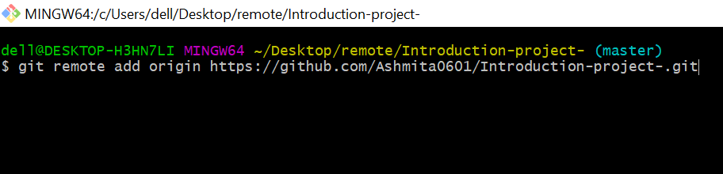

    > `git remote` command is used to check whether we are connected with our repository or not.

    <br> 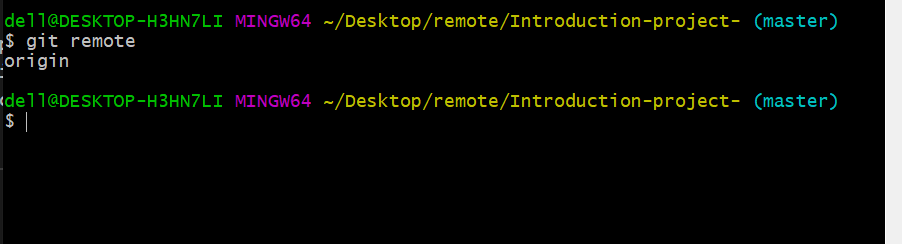

    > To see the url link also of the repository along with remote, `git remote -v` command is used.

    <br> 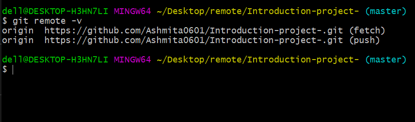

  - Origin<br>
    > It is the common name given to the remote repository by the system.We can also change the alias name if we want by using `git remote rename origin mynewalias`
  - Cloning

    > Cloning is the process of copying the github(online cloud / gitlab ) repository to our local memory. We can clone the repo by copying the repo url from github/gitlab.
    > <br>

    > The command line for **clone** is:<br> > `git clone <remote path(repository url)>`<br>

    > How can we clone github repository?<br>

    1. Create a new folder where you want to clone new directory.<br>
    2. Open git bash inside that folder.<br>
    3. Then go to github to the page of repository that you want to clone.<br>
    4. Click on the code on the upper right corner where you can find the url to clone your repository.<br/>

    

    1. Now copy the code and use the command line to clone your repository

    <br>

    
    <br>

    > The result after cloning the repository:<br>

    
    <br>

  - Untracked files , tracked files & modified files
  - branch (default)
  - ### Status

    > The **status** command is a command that shows the situation of a working directory in git. It lets you see whether files have been staged or not and if the files have been tracked.

    > The command line for **status** is:<br/> > `git status`<br/>

    > In git, **status** command has an important role as:

    1. It shows if there is no git file.<br/>
       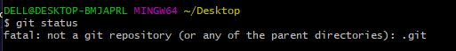

    2. It shows if there is a need of **add** command.<br/>
       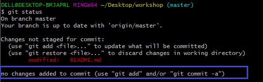

    3. It shows if **commit** command should be used.<br/>
       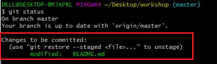

    4. It shows if there has has been a change/modify in the file.<br/>
       

    5. It shows if the file is ready to be pushed.<br/>
       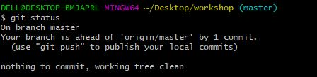 <br/>
       > This command helps a user to push their files to cloud by providing them every steps and shows error if there is one.

  - ### Add

    > The **add** command is used whenever there is a change in the file. It tells git that you want to include updates to a particular file in the next commit. The **add** command actually doesn't records the changes. Updates can be recorded only after running **commit** command. But, the **commit** command can only run after executing the **add** command.

    The command line for **add** is:

         `git add 'filename'` or `git add .` where "." means all files.

    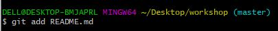
    <br>
    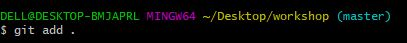<br/>

  - ### Commit

    > The **commit** command is used to save your changes to the local repository.

    **Command Line for commit :** <br>

    - `"-m" ` parameter sets the commit's message : <br>
      `git commit -m "changes message" ` <br>
      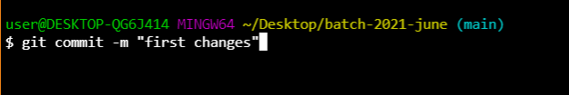

    - `"-a"` parameter includes all currently changed files in the commit :<br>
      `git commit -a ` <br>

      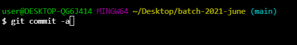

    - `"--amend" ` parameter rewrites the very last commit with any currently staged changes and/or a new commit message :<br>
      ` git commit --amend`

      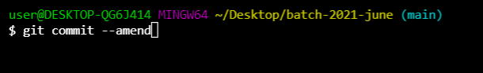

  ***

- ## Alias

  Alias simply means an alternative name. We can use aliases to serve as substitutes for commands in Git which can create following advantages:

  Long commands can be shortened and thus made more memorable.
  Commands that is used frequently can be shortened for more efficient use.
  How to define and use aliases
  You can use git config command with the alias and the command you want to substitute. For example, to create the alias p for git push:

  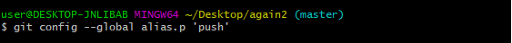

  This enables us to use the command git p like any other git command whenever you have to use git push command.

  To see all your aliases:

  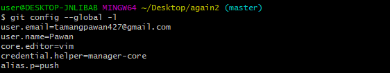

  Regardless of the method you use, defining aliases improves your overall experience with Git.

- diff
- Advanced branch

---

## Guides

In order to start learning git, we need to first download and install git. Here is the link for git: <br/> `https://git-scm.com/downloads`

---

## Why do we use git?

GIT is a program that works as a distributed revision control and source code management system. It facilitates different developers to work safely on a particular task without facing any hassles. It is important to know that the GIT software is free, but it is distributed under the terms and conditions of the GNU general public license.

It plays an important role by ensuring that all web development tasks are done smoothly without any major issues. Some of its reason for becoming most use softarwe for web developers are:

1.  It allows you to have several versions of a project at the same time.
1.  It allows more than one developer to work on a project.
1.  It allows saving copies of project for backups.

---

## Conclusion

In conclusion, it’s important to understand that GIT comes as a savior in many aspects of [web application development](https://www.aapnainfotech.com/wp-content/uploads/2020/06/web-application-development-company.jpg) activities. If you’re in charge of a web development team and want to ensure smooth running and hassle-free project execution, the GIT software is highly recommended.

---

## Contributers

- [**Rakesh Shrestha**](https://github.com/aomini)
- [**Shreyash Shrestha**](https://github.com/Shr3yashhh)
- [**Debrath Sharma**](https://github.com/Madara-coder)
- [**Sagar Karki**](https://github.com/skarki-afk)
- [**Manjila Shakya**](https://github.com/Manjila762)
- [**Ritika Budhathoki**](https://github.com/Ritika0772)
- [**Sudesh Acharya**](https://github.com/thesudesh)
- [**Pawan Tamang**](https://github.com/wreck22)
- [**Amisha Rijal**](https://github.com/rijalamisha21)

---
