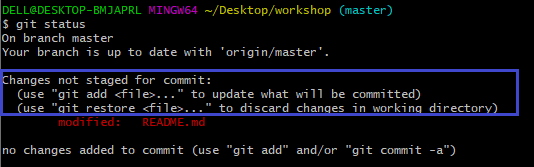
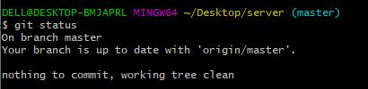

# Batch-2021-june

Repositories &amp; exercises of batch 2021 july.

## Table of Contents

  - [Setup and installation](#setup-and-installation)
  - [How to write a markdown](#how-to-write-a-markdown)
  - [Git](#git)
  - [Guides](#guides)
  - [Contributers](#contributers)

## Setup and installation

> First, you need to clone the repository inorder to access the content.   > `git clone https://github.com/iBootcamp/batch-2021-june.git`

---

## How to write a markdown

## Git

- Introduction
  - Git
    >Git is a software which is used to in our local computer(PC or laptop) to track file or folders which contains data of users and saves the files or folders date for future use. Git is mordern way of saving, protecting and sharing our program files. Git is also known as version control software. Version control simply means the way of managing changes of the softwar code or application code with previous version and we can easily track previous data easily. Git can be used for personal use or office use(team use).We can use git with command line(Git bash) or with git GUI. There are other Git GUI interfaces which are easy to use example tortoise-git (https://tortoisegit.org/download/).

  - Github
    >Github is a online cloude aka online storage where we can keep our program file and documents mostly software data or codes over there. Github makes use of git hence we can view our commits and changes in github aslw well. We use git command to push local data(PC data) from our local repository(add link) to Github repository(Remote). In github we can get open source code and use it freely by cloning in our local computer. There are other similiar platform like gitlab bitbucket and many more.
  - Git vs Github

        | Git                                           | Github                                        |
        | -------------                                 | -------------                                 |
        |1. Installed locally                           |1. Hosted in the cloud                         |
        |2. First released in 2005                      |2. Company launched in 2008                    | 
        |3. Focused on version control and sharing      |3. Focused on centralized source code hosting  |
        |4. Primarily a command line tool               |4. Administered through the web                | 
        |5. Provides a desktop interface named Git Gui  |5. Desktop interface named Github Desktop      |
        |6. No user management                          |6. Built-in user management                    | 
        |7. Minimal external tool                       |7. Active marketplace for tool integration     | 
        |8. Open source licened                         |8. Inludes a free tier and pay-for-use tiers   |
        

  - Motivation
- Guides
- Documentation
  - Initialize a repo
  - Remote
    - Add Remote
    - Origin
  - Clone
    > Clone is the process of copying the github (online cloud / gitlab ) repository to our local memory.
 
    >The command line for **clone** is: 
    `git clone <remote path(repository url)>`
     
    
     
    >The result after cloning the repository: 
    
     
  - Untracked files , tracked files & modified files
  - branch (default)
  - ### Status
    >The command line for **status** is: 
    `git status` 
    >In git, **status** command has an important role as:
    1. It shows if there is no git file. 
    

    1. It shows if there is a need of **add** command. 
    

    1. It shows if **commit** command should be used. 
    

    1. It shows if there has has been a change/modify in the file. 
    

    1. It shows if the file is ready to be pushed. 
      
    >This command helps a user to push their files to cloud by providing them every steps and shows error if there is one.

 

  - ### Add
    >The command line for **add** is: 
    `git add *filename*` or `git add .` where "." means all files.  
     
     
    >This command is used whenever there is a change in the file. Without this command,**commit** command cannot be executed.

  - commit
  - alias
  - diff
  - Advanced branch

## Guides
In order to start learning git, we need to first download and install git. Here is the link for git:     `https://git-scm.com/downloads`

---
## Contributers

- [**Rakesh Shrestha**](https://github.com/aomini)
- [**shreyash Shrestha**](https://github.com/Shr3yashhh)
- [**Debrath Sharma**](https://github.com/Madara-coder)
- [**Sudesh Acharya**](https://github.com/thesudesh)
- [**Sagar Karki**](https://github.com/skarki-afk)
---
